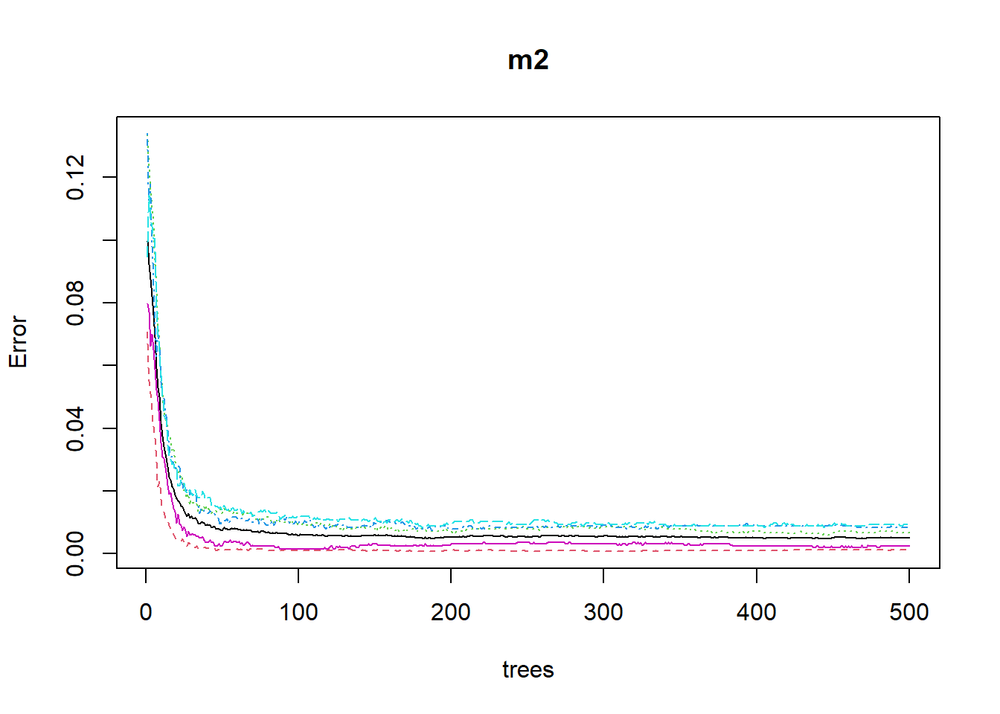
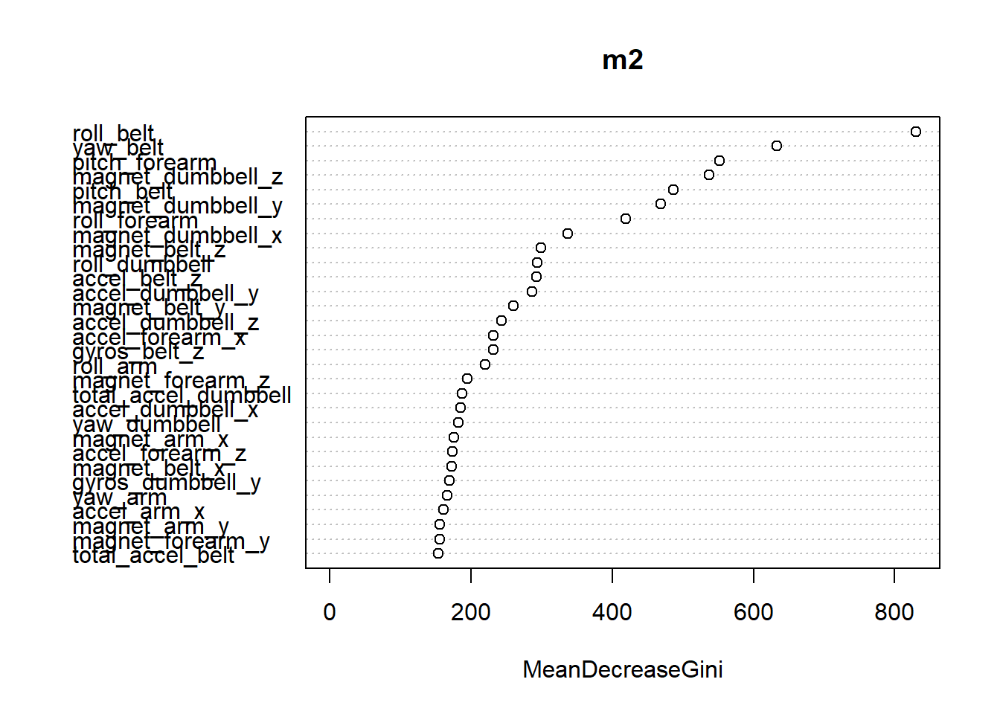

# Summary  
The following report is for predicting whether a person is doing an exercise 
properly or not by the outcome classe. The outcome is a factor variable 
consisting of 5 levels (A,B,C,D,E). Where A level indicates that the exercise is
done properly and the rest show that there are common mistakes. The prediction 
is done by using random forest. The explanation for model selection can be found 
in the relevant section of the report.  

# Loading the required libraries  

```r
library(data.table)
library(caret)
library(ggplot2)
library(randomForest)
```

# Data Description  
Using devices such as Jawbone Up, Nike FuelBand, and Fitbit it is now possible to collect a large amount of data about personal activity relatively inexpensively. These type of devices are part of the quantified self movement – a group of enthusiasts who take measurements about themselves regularly to improve their health, to find patterns in their behavior, or because they are tech geeks.  


# Reading the data 

```r
url1 <- "https://d396qusza40orc.cloudfront.net/predmachlearn/pml-training.csv"
download.file(url1, destfile = "train.csv")
url2 <- "https://d396qusza40orc.cloudfront.net/predmachlearn/pml-testing.csv"
download.file(url2, destfile = "test.csv")
trainData <- read.csv("train.csv")
testData <- read.csv("test.csv")
```

# Preprocessing and Data Cleaning  
## Missing values
By a first glance we can see that a lot of the columns have NA values. We will 
eliminate all those columns which have 95% missing values since they will impact
our model.  The first 7 columns are irrelevant to our model. The contents are 
serial umber and timestamps which are irrelevant because we need numerical 
values of the accelerometers rather than serial or timestamps.  


```r
waste <- sapply(trainData, function(x) mean(is.na(x))) > 0.95
trainData <- trainData[,waste == FALSE]
testData <- testData[,waste == FALSE]
trainData <- trainData[,-c(1:7)]
testData <- testData[,-c(1:7)]
```
## Near Zero Variance  
We will check for near zero variance columns in the data. If found we will 
drop that particular column. As we know that near zero variance columns may 
make our model unstable. We would be applying the same steps for the test 
data as well.  


```r
n <- nearZeroVar(trainData)
trainData <- trainData[,-n]
testData <- testData[,-n]
```


## Creating a validation dataset

```r
set.seed(12266)
forCross <- createDataPartition(y = trainData$classe, p = 0.7, list = FALSE)
train2 <- trainData[forCross,]
test2 <- trainData[-forCross,]
```
# Model Selection  
Since our main goal is to predict the way an exercise is done i.e Correct or the 
different types of common mistakes made. Hence we have to classify the result in 
1 of the 5 levels. The primary candidates for this task would be Decision Tree
or Random Forest. Since Random Forest holds clear advantage over Decision Tree
we will fit our data with random forest then tune it accordingly.  

## Fitting and Tuning  

```r
m2 <- randomForest(as.factor(classe) ~., data = train2)
plot(m2)
```

<!-- -->

From the plot we can observe that there is a plateau after approximately 150 
or 180 trees. Hence we can reduce the number of trees from 500 to 180 just to
get some buffer.  

```r
p2 <- predict(m2, test2)
confusionMatrix(p2, factor(test2$classe))
```

```
## Confusion Matrix and Statistics
## 
##           Reference
## Prediction    A    B    C    D    E
##          A 1674    5    0    0    0
##          B    0 1132    4    0    0
##          C    0    2 1021   10    2
##          D    0    0    1  954    0
##          E    0    0    0    0 1080
## 
## Overall Statistics
##                                           
##                Accuracy : 0.9959          
##                  95% CI : (0.9939, 0.9974)
##     No Information Rate : 0.2845          
##     P-Value [Acc > NIR] : < 2.2e-16       
##                                           
##                   Kappa : 0.9948          
##                                           
##  Mcnemar's Test P-Value : NA              
## 
## Statistics by Class:
## 
##                      Class: A Class: B Class: C Class: D Class: E
## Sensitivity            1.0000   0.9939   0.9951   0.9896   0.9982
## Specificity            0.9988   0.9992   0.9971   0.9998   1.0000
## Pos Pred Value         0.9970   0.9965   0.9865   0.9990   1.0000
## Neg Pred Value         1.0000   0.9985   0.9990   0.9980   0.9996
## Prevalence             0.2845   0.1935   0.1743   0.1638   0.1839
## Detection Rate         0.2845   0.1924   0.1735   0.1621   0.1835
## Detection Prevalence   0.2853   0.1930   0.1759   0.1623   0.1835
## Balanced Accuracy      0.9994   0.9965   0.9961   0.9947   0.9991
```

```r
varImpPlot(m2)
```

<!-- -->
The accuracy is very good for the model and since it had another subset of the
training dataset. Also from the important variables plot we may use mtry with 
10 predictors just to eliminate the chances of missing out on important parameters.  

# Final Model

```r
final_mod <- randomForest(as.factor(classe)~.,data = train2, ntree = 170, mtry = 10)
p3 <- predict(final_mod, test2)
conf <- confusionMatrix(p3, factor(test2$classe))
print(conf)
```

```
## Confusion Matrix and Statistics
## 
##           Reference
## Prediction    A    B    C    D    E
##          A 1674    4    0    0    0
##          B    0 1133    3    0    0
##          C    0    2 1023    7    2
##          D    0    0    0  957    1
##          E    0    0    0    0 1079
## 
## Overall Statistics
##                                          
##                Accuracy : 0.9968         
##                  95% CI : (0.995, 0.9981)
##     No Information Rate : 0.2845         
##     P-Value [Acc > NIR] : < 2.2e-16      
##                                          
##                   Kappa : 0.9959         
##                                          
##  Mcnemar's Test P-Value : NA             
## 
## Statistics by Class:
## 
##                      Class: A Class: B Class: C Class: D Class: E
## Sensitivity            1.0000   0.9947   0.9971   0.9927   0.9972
## Specificity            0.9991   0.9994   0.9977   0.9998   1.0000
## Pos Pred Value         0.9976   0.9974   0.9894   0.9990   1.0000
## Neg Pred Value         1.0000   0.9987   0.9994   0.9986   0.9994
## Prevalence             0.2845   0.1935   0.1743   0.1638   0.1839
## Detection Rate         0.2845   0.1925   0.1738   0.1626   0.1833
## Detection Prevalence   0.2851   0.1930   0.1757   0.1628   0.1833
## Balanced Accuracy      0.9995   0.9971   0.9974   0.9963   0.9986
```

```r
head(p3)
```

```
##  2  5 10 14 16 18 
##  A  A  A  A  A  A 
## Levels: A B C D E
```
As we can see there is a slight improvement in the accuracy.

## Out of Sample Error  

```r
oose <- 1 - conf$overall['Accuracy']
```
The Out of Sample Error is 0.0032285

# Predicting the Test data  
Using our tuned random forest for the final prediction.  

```r
predict(final_mod, testData)
```

```
##  1  2  3  4  5  6  7  8  9 10 11 12 13 14 15 16 17 18 19 20 
##  B  A  B  A  A  E  D  B  A  A  B  C  B  A  E  E  A  B  B  B 
## Levels: A B C D E
```


